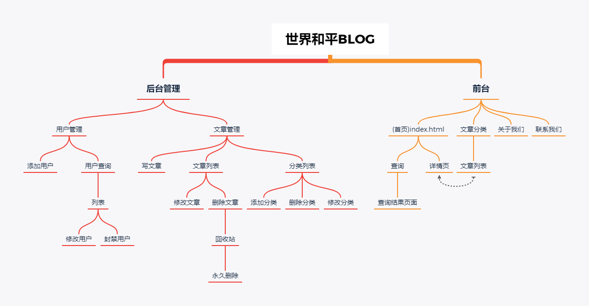

# blog20200103

## 介绍
基于jquery+Bootstrap+php+mysql的blog系统
一个后台管理系统,文章管理,用户管理,前台显示内容

## 网站架构

## 技术栈

##### 前端部分
    1. jquery
    2. Bootstrap框架
##### 后端部分
    1. php
    2. mysql

## 版本管理

git 生产/开发模型 (支持 master/develop 类型分支)

#### 当前版本号
v0.1版本

